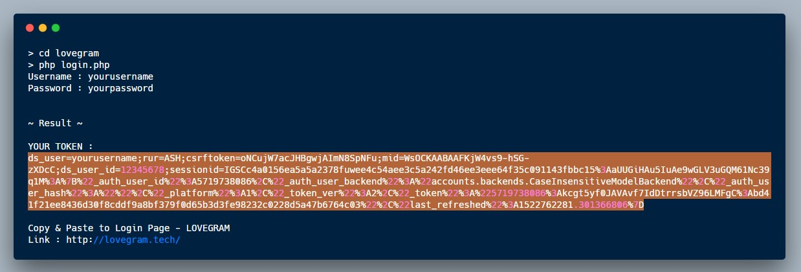

# LOVEGRAM - Instagram Login :bomb:

Install
--

- First step

```
1. pkg install git
2. pkg install php
```

- Second step
```
1. git clone https://github.com/dandyraka/lovegram.git
2. cd lovegram
3. php login.php
```

Input your instagram Username & Password.

Then copy the TOKEN to Lovegram Login page



Updating
--

```
git pull --force
```
